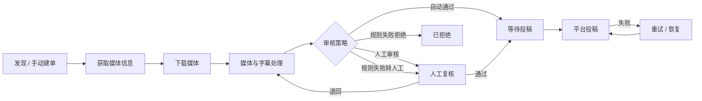
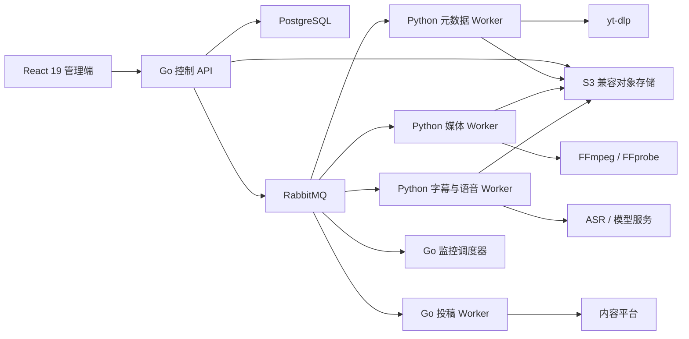

<p align="center">
  
</p>

<h1 align="center">Visoraft</h1>

<p align="center"><strong>视频发现、媒体处理、字幕生产、内容复核与平台投稿的一体化本地操作台</strong></p>

<p align="center">发现与监控 · 下载与媒体 · 字幕与审核 · 平台投稿</p>

<p align="center">
  
  
  
  
  
  
</p>

<p align="center">
  <a href="#本地启动">本地启动</a> ·
  <a href="#系统架构">系统架构</a> ·
  <a href="#开发与验证">开发与验证</a> ·
  <a href="docs/README.md">项目文档</a> ·
  <a href="CHANGELOG.md">更新记录</a>
</p>

> [!IMPORTANT]
> `v0.1.1` 是当前可运行的本地增量基线，并不代表全部生产能力已经验收完成。真实 AcFun 投稿、阿里云内容安全、生产级权限/安全与运维仍保持 `in_progress`，必须在有效凭证和目标环境中完成验收后才能用于正式业务。

## v0.1.1 更新重点

- 按新版交互原型统一核心页面、全局顶栏、按钮、状态与浅色/深色主题表现。
- 增加按监控、剧集和独立任务分组的本地媒体库，支持自定义存储位置、文件缺失检测、删除与恢复。
- 修复下载暂停、继续和断点恢复状态，完善任务勾选、审核页签、转载声明与投稿阻塞项交互。
- 提供轻量 Docker 刷新入口，前后端改动无需重复重建完整媒体工具链。
- 统一仓库品牌标识、版本信息和公开文档边界。

## 核心能力

- 通过单条视频 URL 创建媒体任务，持续展示任务步骤、速度、文件大小、预计剩余时间、失败原因与恢复操作。
- 使用 YouTube 搜索、频道或剧集范围进行监控，将筛选结果直接加入统一任务队列，并按外部视频 ID 去重。
- 调度 `yt-dlp`、FFprobe 与 FFmpeg 完成元数据提取、下载、媒体探测、转码和字幕烧录。
- 优先复用平台中文字幕或可验证的画面中文字幕；只有不满足条件时才回退到 ASR、分段、翻译与质检。
- 支持人工审核和自动审核；自动规则失败可按配置转人工或拒绝，所有判断、修改和重试均持久化留痕。
- 管理 Bilibili、AcFun 投稿账号与 Cookie，审核通过后进入投稿工作台，并保存发布结果及失败恢复记录。
- 提供 CookieCloud/Netscape Cookie、全局模型与字幕专用覆盖、ASR、提示词、转码、监控和投稿策略配置。
- 提供资源文件中心、浅色/深色主题、桌面与窄屏布局及全站可读性检查。
- 将任务产物同步到用户可见的本地媒体库；监控任务按节目、分部和集数整理，独立任务单独归档，并可检测手动删除后恢复。

## 任务流程



## 系统架构



Go 负责 API、状态机、调度、审核和投稿编排；Python Worker 负责下载、媒体、字幕、ASR 与模型处理。任务状态、配置快照、Outbox 和审计写入 PostgreSQL，耗时步骤通过 RabbitMQ 投递，媒体产物写入 S3 兼容对象存储。

## 本地启动

### 环境要求

- Windows 10/11 与 PowerShell 7（推荐）
- Docker Desktop，支持 Docker Compose v2
- 首次构建时可访问容器镜像和依赖源
- 建议至少 8 GB 内存；长视频转码建议预留更多磁盘空间

### 1. 获取项目

```powershell
git clone https://github.com/ChenXj6/Visoraft.git
cd Visoraft
```

### 2. 创建本地配置

```powershell
Copy-Item .env.example .env
```

编辑 `.env`，至少替换示例中的加密密钥和本地服务口令。需要真实下载、ASR、模型或投稿时，再通过网页设置中心录入相应凭证；不要提交 `.env`、Cookie 文件或任何真实密钥。

### 3. 启动完整本地链路

```powershell
.\scripts\local.ps1 up
```

Docker Desktop 中的“启动”只会启动上一次构建的容器，不会读取后来修改的源码。更新代码或切换版本后，请双击项目根目录的 `刷新本地Docker版本.cmd`，或执行：

```powershell
.\scripts\local.ps1 refresh
```

该操作只重建管理页面和控制接口，并强制创建对应容器，完成后还会校验当前文件库接口，避免旧镜像被误认为启动成功。需要更新全部后台和媒体服务时，执行 `.\scripts\local.ps1 refresh-all`；该操作会使用 Docker 缓存，不会每次重新编译 FFmpeg。之后没有代码变更时，可以继续直接使用 Docker Desktop 启停项目。

启动成功后可访问：

| 服务 | 地址 |
| --- | --- |
| Visoraft 管理端 | http://localhost:4173 |
| 控制 API 健康检查 | http://localhost:8080/health/ready |
| RabbitMQ 管理端 | http://localhost:15673 |
| S3 兼容对象服务 | http://localhost:8333 |

常用操作：

```powershell
.\scripts\local.ps1 status
.\scripts\local.ps1 logs
.\scripts\local.ps1 down
```

本地媒体库默认位于项目的 `storage/library`。也可以先在“设置 → 本地媒体库”填写新的绝对路径，再执行：

```powershell
.\scripts\local.ps1 storage
```

也可直接指定路径：`.\scripts\local.ps1 storage -Path 'D:\媒体库'`。路径切换不会删除旧目录；新位置应用后，系统按需重新同步文件。

`reset -Force` 会删除本地数据库、队列和对象存储卷，只应在确认不再需要本地任务与媒体后使用。

## 首次使用

1. 在“Cookie”页面导入 Netscape Cookie 文件或同步 CookieCloud，并执行连接校验。
2. 在“设置”中配置模型、字幕策略、ASR、转码、审核与投稿策略。
3. 在“投稿”页面绑定目标平台账号并校验登录状态。
4. 使用“新建任务”处理单条 URL，或在“监控”中创建搜索、频道、剧集范围监控。
5. 在任务详情查看下载、字幕、审核与发布步骤；产物可从“文件中心”查看。

## 开发与验证

前端使用 pnpm 工作区：

```powershell
pnpm install --frozen-lockfile
pnpm typecheck
pnpm build
```

Go 与 Python 检查：

```powershell
go test ./...
python -m pytest workers/media/tests
```

本地服务启动后可执行端到端检查：

```powershell
pnpm e2e:local
pnpm e2e:operations
pnpm e2e:dark
```

## 目录结构

```text
apps/web/                 React 19 管理端
cmd/                      Go 服务入口
internal/                 Go 领域、接口与基础设施实现
workers/media/            Python 下载、媒体、字幕与模型 Worker
deploy/                   数据库迁移和部署相关文件
tests/                    契约与端到端测试
scripts/                  本地启动、检查和运维脚本
assets/brand/             品牌资源
docs/v1/                  当前 V1 的产品、架构、计划与测试文档
docs/v2/                  下一代 V2 的产品规划、架构与实施计划
diagram/v1|v2/            按代际归档的流程图与架构图
artifacts/v1|v2/          按代际归档的本地测试证据（默认不入库）
compose.yaml              本地完整服务编排
```

当前可运行源码属于 V1；V2 尚处于下一代产品规划阶段。版本资料入口见 [文档版本索引](docs/README.md)，源码代际规则见 [代码版本策略](docs/CODE_VERSIONING.md)。

哪些文件可以公开、哪些必须留在本地，见 [V1 公开仓库边界](docs/v1/architecture/PUBLICATION_BOUNDARY.md)。FFmpeg 的许可构建边界见 [V1 FFmpeg LGPL 构建说明](docs/v1/architecture/ffmpeg-lgpl-build.md)，当前内部实现说明见 [V1 技术实现文档](docs/v1/architecture/TECHNICAL_IMPLEMENTATION.md)。

## 当前验证边界

| 范围 | `v0.1.1` 状态 |
| --- | --- |
| 本地容器、任务状态机、下载、媒体与字幕链路 | 已纳入本地与自动化验证 |
| 人工/自动审核及失败恢复 | 已纳入持久化链路验证 |
| YouTube 监控与建单 | 已纳入真实 Data API 和本地流程验证 |
| 核心页面、固定顶栏、浅色/深色主题 | 已完成核心 9 页面自动化布局检查；全部路由、弹窗与边界状态逐像素验收仍在继续 |
| 本地媒体库、监控分组、文件删除与恢复 | 页面与接口已联调；真实磁盘破坏性场景仍需按目标目录策略复验 |
| Bilibili 投稿 | 需要使用者以当前有效账号再次完成真实平台验收 |
| AcFun 投稿 | 适配入口已保留，真实平台闭环待有效账号验收 |
| 生产部署、高可用与安全基线 | 不属于本地封版完成声明，需按实际环境另行验收 |

## 安全与数据

- 密钥只在服务端保存，接口仅返回“是否已配置”。
- Cookie 临时文件应限制权限并在 Worker 执行结束后删除。
- 下载媒体、字幕、任务数据、数据库转储、日志和测试截图默认不进入 Git。
- 发布前请再次执行仓库敏感信息扫描，并撤销任何曾在聊天、日志或截图中暴露的凭证。

## 许可证

Visoraft 源码使用 [Apache License 2.0](LICENSE)。第三方组件仍遵循各自许可证，详见 [THIRD_PARTY_NOTICES.md](THIRD_PARTY_NOTICES.md) 与 [NOTICE](NOTICE)。
