# Visoraft 全功能测试流程与节点策略

状态：`draft_for_confirmation`
说明：本文件只定义测试流程，尚未开始真实链路测试。消息推送按用户要求不进入当前范围；旧“来源记录/权利确认”流程已移除，不设置独立确认页。

## 0. 统一节点验收规则

每个节点都必须收集五类证据：

1. 前端：入口、输入、加载、禁用、成功、失败和下一步提示；
2. 接口：请求、稳定错误码、幂等/版本冲突和持久化结果；
3. 服务：Go/Python Worker 的真实执行记录；
4. 数据：PostgreSQL、对象存储、队列或平台回执；
5. 恢复：重试、修订、取消、对账、回滚或人工接管。

任何节点只通过 fixture、固定返回值或页面占位时，结果必须记为“未通过/待真实配置”，不能记为完成。

## 1. 首次启动、身份与系统健康

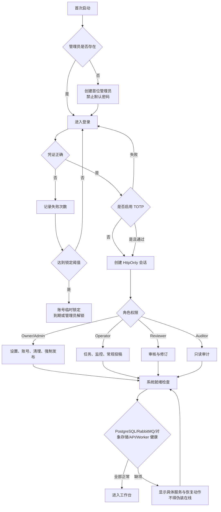

节点策略：

| 节点 | 策略与分支 | 成功结果 | 失败结果 | 恢复入口 |
| --- | --- | --- | --- | --- |
| A1 | 首次初始化 / 已初始化 | 只允许创建一次首位管理员 | 重复初始化被拒绝 | 使用已有管理员登录 |
| A4 | 正确、错误、空值、暴力尝试 | 建立认证流程 | 剩余次数、锁定时间明确 | 等待解锁、管理员解锁 |
| A5 | TOTP 关闭 / 开启并正确 / 开启但错误 | 完成二次认证 | 不创建会话 | 重新输入或恢复码 |
| A10 | Owner/Admin/Operator/Reviewer/Auditor | 只显示有权入口 | 越权返回 403 并审计 | 管理员调整角色 |
| A16 | 单服务失败 / 多服务失败 / Worker 失联 / 队列积压 | 状态页可定位组件 | 阻止依赖该组件的动作 | 服务恢复后重新检查 |

## 2. 仪表盘、导航与实时状态

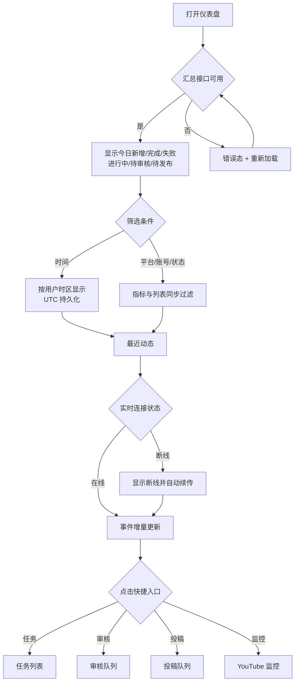

节点策略：空数据、少量数据、大量数据、部分接口失败、实时流断线、跨时区显示、长标题与移动端卡片均单独验证。

## 3. 单次任务创建、列表、编辑与版本

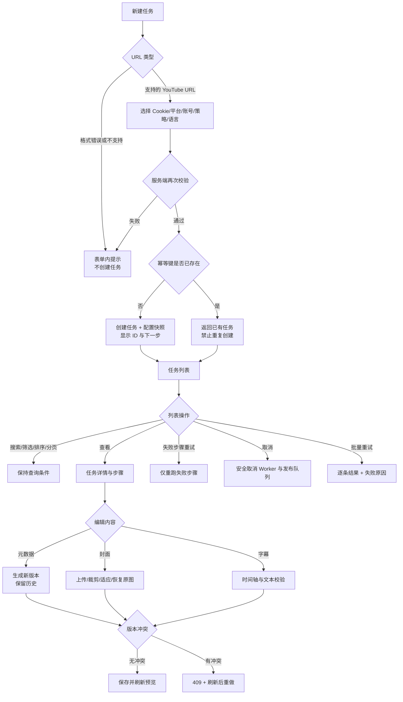

节点策略：

- C1：标准 watch URL、短链、播放列表参数、重复 URL、空值、非 YouTube URL；
- C2：AcFun、Bilibili、双平台；手动投稿、审核后自动投稿；人工/自动审核；字幕开关；
- C5：同请求并发两次、浏览器重复点击、API 超时后重发；
- C12：认证失败、网络失败、不可重试参数错误、已经成功的步骤；
- C13：下载中、转码中、字幕中、投稿排队中、投稿结果不确定；结果不确定必须先对账；
- C16：标题/简介/标签/双平台分区/转载声明预览与平台长度限制；
- C17：JPG/JPEG/PNG/WEBP、非法格式、超大文件、裁剪、恢复原封面；
- C18：空字幕、时轴倒置、重叠、超长文本、原文与译文切换。

## 4. CookieCloud、Cookie 文件与平台账号

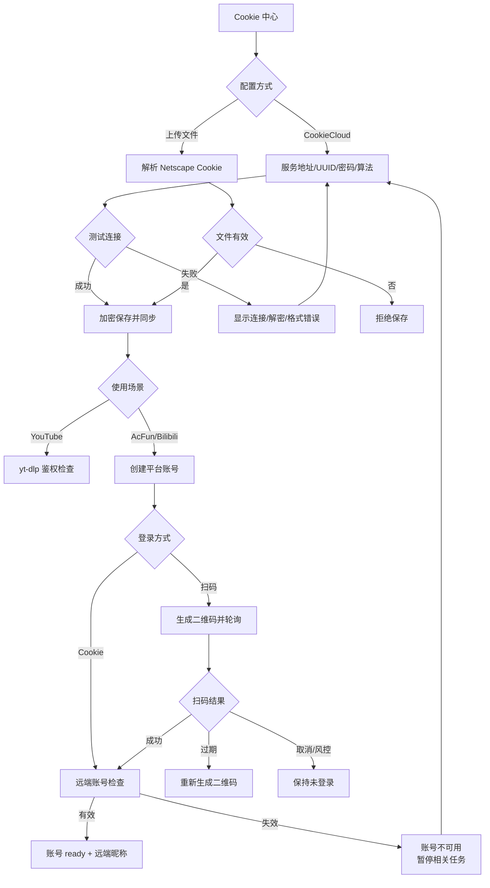

节点策略：密码不回填、空密码保存保留原值；Secret 不经 API 回读；Cookie 过期时任务进入可恢复认证错误；fixture 账号只能处理 fixture 来源，真实来源必须阻断。

## 5. YouTube 全站检索与频道监控

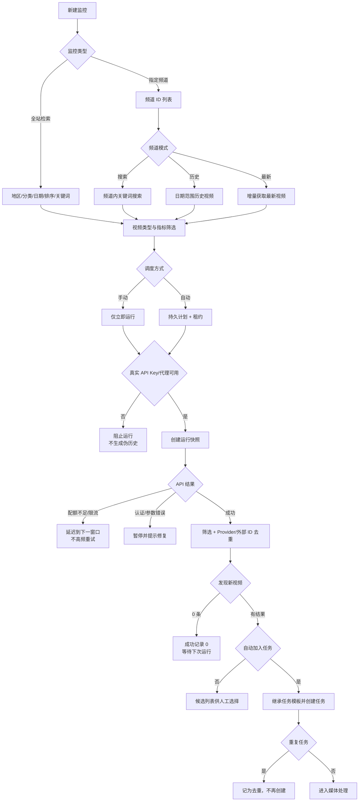

删除监控分支：二次确认 → 选择“保留历史并归档”或“永久删除历史”；暂停、恢复、立即运行和下一次运行预览分别留证。

## 6. 元数据、下载、对象存储与失败恢复

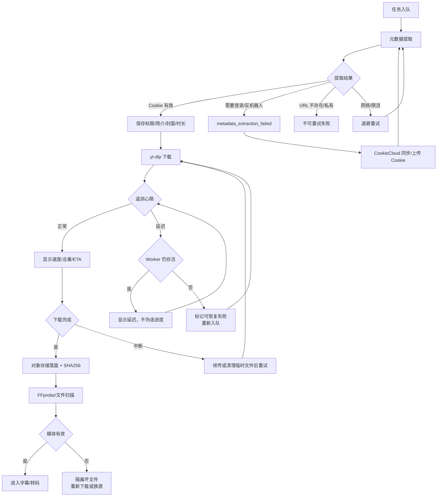

下载节点必须验证：服务重启、Worker kill、队列重投、浏览器刷新、旧 Worker 只有阶段消息、文件总量未知和下载完成后遥测清零。

## 7. AI、ASR、字幕、翻译、分段与质检

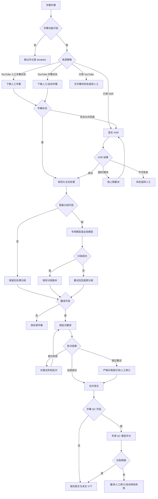

模型覆盖策略：全局模型；字幕翻译 override/global；智能分段 override/global；字幕 QC override/global。每层分别验证 Base URL、API Key、模型、Thinking、超时、温度、凭证缺失和连通性失败。

## 8. 转码、字幕烧录与内容审核

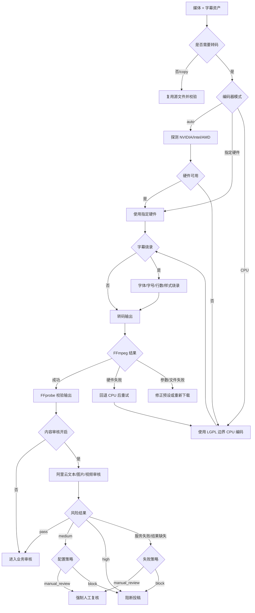

## 9. 人工审核与自动审核

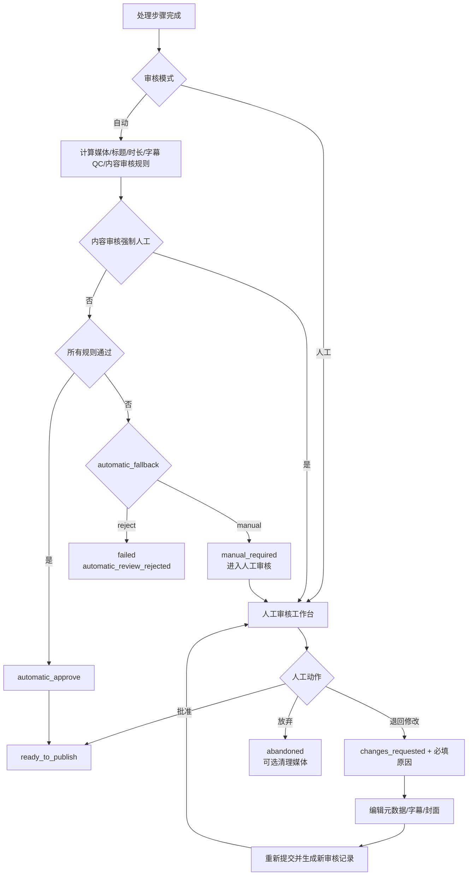

自动规则逐项单独失败：媒体缺失、标题为空、简介长度、最大时长、字幕 QC 缺失、字幕 QC 低于阈值、内容审核阻断、内容审核结果缺失。每一种都分别执行 `manual` 与 `reject` 两个策略。

## 10. 投稿策略、AcFun/Bilibili 发布与对账

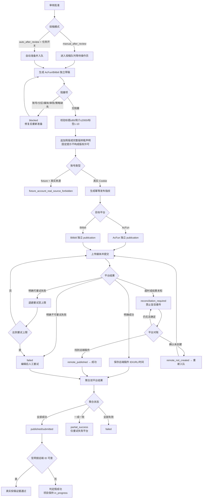

## 11. 取消、失败重试、回收站与清理

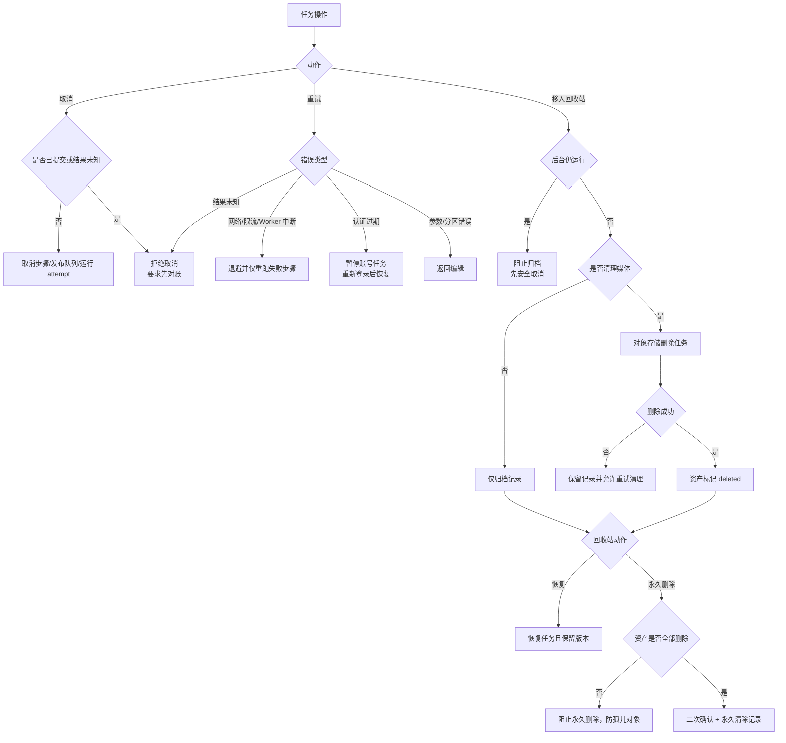

## 12. 设置、Secret、响应式与可访问性

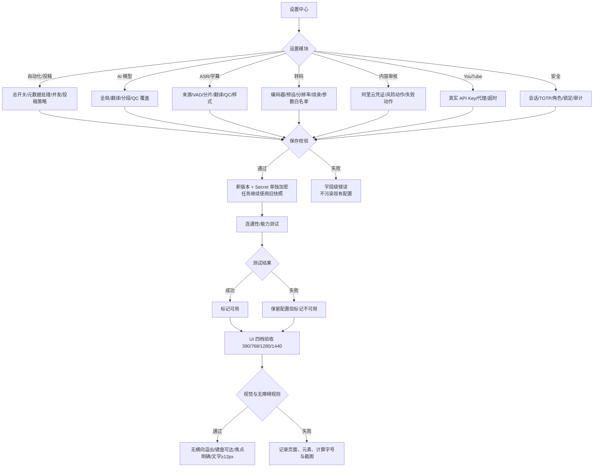

设置节点还必须验证：API Key/密码不回填；空值保存保留旧 Secret；清空 Secret 需要独立确认；并发限制分别作用于 Worker 池与平台账号；非法 FFmpeg 参数、网络 URL 和越权路径被拒绝。

## 13. 本轮执行顺序（流程图确认后才开始）

1. 补齐真实模型、ASR、YouTube Data API、阿里云审核和 AcFun 凭证；
2. 从空任务库创建一条全链路真实任务；
3. 先跑人工审核主线，再跑自动审核通过、失败转人工、失败拒绝；
4. 分别跑 Bilibili、AcFun、双平台、部分成功与结果未知对账；
5. 再跑监控、批量操作、回收站、设置、权限、响应式与异常恢复；
6. 每个节点按编号写入结果矩阵，任何缺项都保持 `in_progress`。
