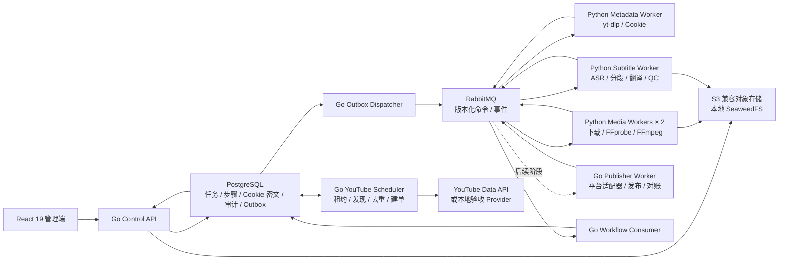
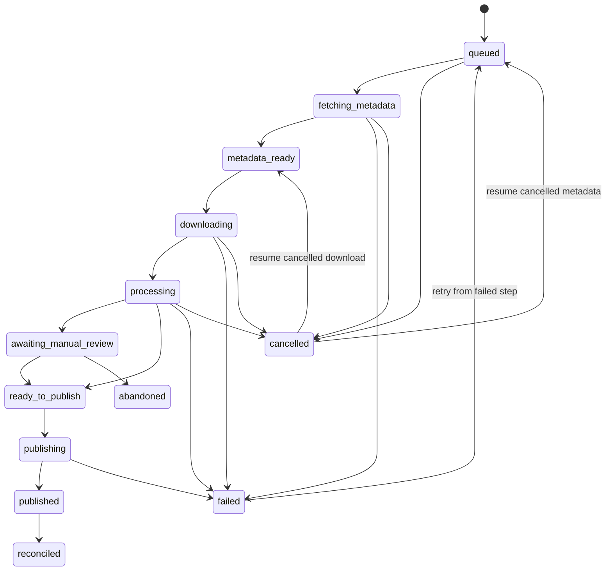

# Visoraft 目标架构

## 设计目标

系统必须在进程重启、消息重复、单步失败和外部平台超时后继续恢复；控制面不能把任务真相放在内存、后台线程或消息队列中。

## 服务边界

| 服务 | 语言 | 责任 |
|---|---|---|
| Web | React 19 | 总览、任务、人工复核、监控、账号、设置和运维 |
| Control API | Go | 认证/RBAC、输入校验、业务事务、状态查询、SSE |
| Outbox Dispatcher | Go | 从 PostgreSQL 可靠发布命令/事件到 RabbitMQ |
| Workflow Consumer | Go | 验证 Worker 结果并推进持久状态机 |
| YouTube Scheduler | Go | 持久监控计划、租约、过期恢复、发现去重和统一建单 |
| Publisher Worker（后续） | Go | AcFun/bilibili 适配、上传、取消、对账；当前尚未实现 |
| Metadata Worker | Python | yt-dlp 元数据解析、Cookie 临时取用和错误分类 |
| Media Worker（本地 2 副本） | Python | 下载、FFprobe、媒体算法和 FFmpeg 调用 |
| Subtitle Worker | Python | 平台字幕、ASR、后处理、智能分段、翻译、严格补救和 QC |

## 数据真相

- PostgreSQL 是任务、步骤、Cookie 配置状态、尝试次数、租约和审计的唯一业务真相。
- RabbitMQ 采用至少一次投递；消息可能重复、延迟或乱序。
- 每个命令携带唯一消息 ID、任务 ID、步骤、尝试号和契约版本。
- 消费者用消息 ID 与步骤版本实现幂等，只有成功持久化结果后才确认消息。
- Outbox 保证“业务提交成功但消息未发出”能够自动补偿。
- 元数据命令与下载/探测命令使用不同队列；长下载不会阻塞新任务的信息读取。
- Pika 消费连接只维持心跳与投递确认，耗时工作在线程中执行并通过独立发布连接上报。服务停机时未完成投递 NACK 并重新入队，不生成用户取消事件。

## 任务状态

任务顶层状态用于用户理解；每个实际动作都在 `task_steps` 中保存更细的状态、进度、尝试和错误。重试从失败步骤继续，不整条重跑。

## 任务输入与发布备注

- 来源 URL 只作为 yt-dlp 和下载 Worker 的执行输入，直接保存在任务中。
- 系统不采集、保存或展示独立的来源权利记录。
- 建单只要求视频 URL、目标平台、可选 Cookie 配置和转载声明版本。
- 自动转载声明保留简版、完整版两种文案，不参与网站登录或机器人验证。

## Cookie 边界

- 浏览器导出的 Netscape `cookies.txt` 在 API 校验后使用 AES-256-GCM 加密保存。
- CookieCloud 只请求用户配置服务的 `/get/:uuid` 加密数据；UUID 与密码在控制面本地完成解密，密码不发送给 CookieCloud 服务端。
- RabbitMQ 命令只携带 Cookie 配置 ID，不携带 Cookie、UUID 或密码。
- Python Worker 执行单个命令时通过内部 Bearer 端点获取 Cookie，在权限为 `0600` 的临时文件中交给 yt-dlp，命令结束后删除。
- 同步成功只代表 Cookie 文件可读取；目标网站仍可能因为过期、风控或账号状态拒绝登录。

## 外部工具边界

- yt-dlp 以锁定版本的 Python wheel 安装，运行在 Media Worker 中。
- YouTube JavaScript 挑战固定使用匹配版本的 `yt-dlp-ejs` 与 Deno，不在任务执行时临时拉取脚本。
- FFmpeg/ffprobe 以受控子进程运行，具备超时、取消、资源配额、结构化日志和版本检查。
- 当前下载完成后先由 FFprobe 生成版本化 `media_info`，写入 PostgreSQL 资产清单并在 React 页面展示；探测失败作为独立步骤失败，不会伪装成下载成功。
- 默认发行只接受 LGPL FFmpeg 构建；自带 GPL/nonfree 组件的外部构建必须由运营方独立评估和提供。
- 平台 Cookie、Token 和 AI 密钥加密保存，任务消息和日志永不输出明文。
