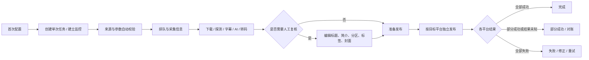
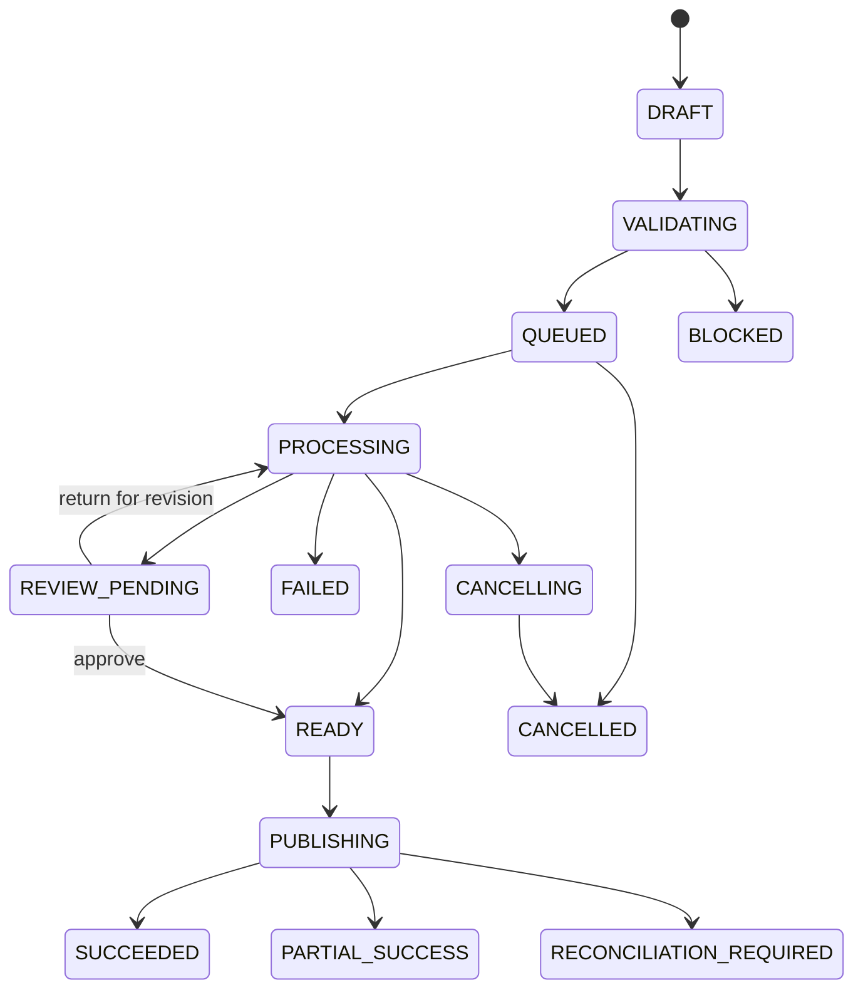

# 原系统完整运行逻辑与新系统验收基线

版本：2026-07-23
依据：`localhost:5000` Playwright 黑盒摸排、`localhost:5001` 隔离状态测试、现有架构包与用户追加要求。

## 1. 文档口径

本文不以接口为中心，只描述：

1. 用户从哪里进入；
2. 页面能看到什么；
3. 用户可以怎么操作；
4. 系统自动执行什么；
5. 任务或配置怎样流转；
6. 成功、失败、重试、人工介入和恢复怎样衔接；
7. 新系统相对原系统必须改进什么。

标记：

- `OBSERVED`：已在原始 5000 或隔离 5001 实际操作确认；
- `UI-CONFIRMED`：由页面文案、按钮状态和操作入口确认，未执行最终外部副作用；
- `TARGET`：新系统必须实现的增强；
- `DEFERRED`：已纳入设计但当前明确暂缓。

## 2. 产品主线

用户不需要经过独立的“确认权利”页面。来源与授权信息直接嵌入任务或监控创建流程，系统自动校验完整性、有效期和适用平台。

## 3. 首次使用与系统准备

### 3.1 快速入门

`OBSERVED`

首页提供快速入门，引导用户依次完成：

1. 配置 AcFun、bilibili、YouTube Cookies 或扫码登录；
2. 配置 AI、ASR、字幕、FFmpeg、审核和并发；
3. 输入 YouTube URL 或建立 YouTube 监控；
4. 系统自动采集、下载、处理标题/简介/标签/分区/字幕；
5. 自动通过后发布，或进入人工审核后编辑并发布。

### 3.2 新系统首次初始化

`TARGET`

- 首次启动创建管理员，禁止默认密码；
- 本地模式提供一键初始化向导；
- 逐项检查 PostgreSQL、RabbitMQ、MinIO、Python Worker、yt-dlp、FFmpeg；
- 平台账号、AI、ASR 未配置时显示可操作的缺失项，不伪装为可用；
- 提供最小本地测试素材，不依赖可能失效的公开 YouTube 视频；
- 消息推送步骤不出现在当前初始化阻塞项中。

## 4. 首页仪表盘

### 4.1 可见信息

`OBSERVED`

- 今日完成；
- 今日失败；
- 今日新增；
- 进行中；
- 待审核；
- 等待处理；
- 准备上传；
- 失败总数；
- 最近动态；
- 总任务数。

### 4.2 快捷操作

`OBSERVED`

- 前往任务列表；
- 前往人工审核；
- 前往 YouTube 监控；
- 打开快速入门；
- 从最近动态查看任务。

### 4.3 新系统增强

`TARGET`

- 指标可按项目、平台、账号、时间筛选；
- 区分处理失败、发布失败、部分成功、待对账；
- 展示队列积压、Worker 健康、磁盘/对象存储和平台账号健康；
- 时间统一使用 UTC 存储、用户时区显示，修复新任务立即显示“8 小时前”的原系统问题；
- 最近动态使用实时事件流，断线可续传。

## 5. 单次任务

### 5.1 创建任务

`OBSERVED`

原系统操作：

1. 打开“新建任务”；
2. 输入 YouTube URL；
3. 选择 AcFun、bilibili 或双平台；
4. 提交后进入等待处理。

原系统只检查输入非空，无效 URL 也能进入后台。

`TARGET`

新系统创建表单必须同时保存：

- 来源 URL；
- 权利人；
- 授权类型：自有、书面授权、开放许可、公版或其他可配置类型；
- 授权证据：文件、文本说明或受控对象引用；
- 适用平台；
- 有效期；
- 转载声明版本：简版或完整版；
- 目标平台和账号；
- 处理模板、语言、发布时间；
- 是否需要人工发布前复核。

操作体验：

1. 浏览器即时识别支持的 URL；
2. Go 服务端再次做 Provider、域名、格式和重复任务校验；
3. 信息不完整时在当前表单内提示，不进入独立权利确认页；
4. 创建成功后立即显示任务 ID、排队位置和下一步；
5. 相同请求通过幂等键避免重复创建。

### 5.2 自动处理链

`OBSERVED`

已实际看到：

- 等待处理；
- 采集信息；
- 信息已获取；
- 下载中；
- 失败。

页面和快速入门确认的后续能力：

- 标题与简介翻译；
- 标签生成；
- 分区推荐；
- 字幕获取/识别/翻译/质检；
- 封面处理；
- 内容审核；
- 自动发布或转人工审核。

`TARGET`

新系统标准步骤：

1. 来源记录自动校验；
2. 来源 URL/文件校验；
3. 获取元数据与封面；
4. yt-dlp 下载或本地文件入库；
5. 文件扫描与 ffprobe；
6. 字幕提取或 ASR；
7. 翻译、分段和字幕 QC；
8. 标题、简介、标签和分区建议；
9. 内容审核；
10. FFmpeg 转码/烧录；
11. 人工复核或自动放行；
12. 按平台独立发布；
13. 必要时对账；
14. 清理临时产物。

每一步都显示状态、进度、耗时、当前 attempt、错误分类和可执行的下一步。

### 5.3 任务列表

`OBSERVED`

列表信息：

- ID 与复制 ID；
- 标题；
- 状态；
- 相对时间；
- 目标平台；
- 分区；
- 标签；
- 上传结果；
- 操作。

操作：

- 新建任务；
- 重新开始单个任务；
- 编辑任务；
- 查看完整错误；
- 删除任务；
- 删除时选择是否同时删除任务文件；
- 批量重试所有失败任务；
- 清空所有任务，并选择是否同时删除所有文件。

移动端会从桌面表格切换为任务卡，保留全部操作。

`TARGET`

- 搜索、筛选、排序、分页和批量选择；
- 单独重试失败步骤，不必整条链重跑；
- 取消正在运行任务并显示安全停止进度；
- 区分“删除任务记录”“清理产物”“远端下架”；
- 远端下架永远是独立高风险操作；
- 批量操作显示影响数量和不可逆范围；
- 删除与清空均需要二次确认；
- 支持失败原因、平台、项目、时间和来源筛选。

### 5.4 错误与重试

`OBSERVED`

- 列表只显示截断错误；
- 点击后显示任务标题、完整 ID 和完整错误；
- 失败任务可单独开始，也可批量重试；
- 原系统不对错误做稳定分类。

`TARGET`

- 网络、限流、认证过期、参数无效、平台变化、远端拒绝、资源不足、结果未知分开处理；
- 可恢复错误按退避策略自动重试；
- 认证过期暂停对应账号任务并引导重新登录；
- 参数/分区错误回到编辑；
- 远端结果未知禁止盲重传，进入对账；
- 一个目标平台失败不覆盖其他平台成功结果。

## 6. 任务编辑

### 6.1 任务信息

`OBSERVED`

- 任务 ID；
- 创建时间；
- 当前状态；
- 目标平台；
- 可外链打开的来源 URL。

### 6.2 封面

`OBSERVED`

- 当前封面或无封面空态；
- 裁剪/适应模式；
- 当前生效文件；
- 上传 JPG、JPEG、PNG、WEBP；
- 替换后恢复原封面。

### 6.3 元数据

`OBSERVED`

- 编辑标题与简介；
- 查看原标题和原描述；
- 显示平台长度上限和当前字数；
- 双平台按共同最低限制；
- 翻译失败时回退原标题；
- 选择 AcFun 或 bilibili 分区；
- 双平台分别选择分区；
- 使用 AI 推荐分区；
- 最多 6 个标签，每个最多 20 字符。

### 6.4 保存与发布

`OBSERVED`

- “保存修改”只保存元数据；
- “上传到平台”先保存再后台发布；
- 失败状态禁用直接上传；
- 等待人工审核状态允许直接上传。

`TARGET`

- 平台预览分别展示最终标题、简介、标签、分区、封面和转载声明；
- 保存产生元数据新版本，不覆盖历史；
- 用户可撤销未发布版本；
- 平台长度截断必须在发布前明确预览；
- 转载声明自动追加，但界面固定提示“转载声明不构成版权许可”。

## 7. 人工审核

### 7.1 审核卡

`OBSERVED`

每条待审核任务显示：

- 待审核状态；
- 任务 ID；
- 当前标题和原标题；
- 描述预览；
- 审核结果；
- 当前分区；
- 标签。

### 7.2 审核操作

`OBSERVED`

- 修改后上传；
- 强制上传到目标平台；
- 放弃任务；
- 放弃时选择是否删除任务文件；
- 强制上传前明确警告其忽略内容审核结果。

### 7.3 新系统语义

`TARGET`

- 人工审核用于媒体、字幕、元数据、内容和发布预览，不新增独立权利确认；
- 审核人可以批准、退回修改、放弃；
- “强制发布”需要特权、二次认证、原因和审计；
- 支持视频、字幕、封面和最终成品预览；
- 缺失媒体时显示可理解的空态与阻塞原因；
- 审核意见和修改版本不可变留痕；
- 移动端可完成基础审核，精细字幕编辑提示使用桌面端。

## 8. YouTube 监控

### 8.1 监控列表

`OBSERVED`

显示：

- 名称；
- 启用/禁用；
- 全网搜索或频道监控；
- 关键词和筛选摘要；
- 手动或自动调度；
- 最后运行；
- 最近运行记录。

操作：

- 新建；
- 立即运行；
- 查看历史；
- 编辑；
- 删除；
- 从配置文件恢复。

### 8.2 新建与编辑

`OBSERVED`

基本设置：

- 名称；
- 启用状态。

监控模式：

- 全网搜索；
- 指定频道；
- 频道搜索；
- 频道历史；
- 频道最新。

全网搜索参数：

- 地区：US、JP、KR、GB、DE、FR、CA、AU；
- YouTube 分类；
- 最近 1–30 天；
- 结果 1–50；
- 排序：观看数、日期、评分、相关度；
- 包含关键词；
- 排除关键词；
- 排除频道。

频道参数：

- 一个或多个频道 ID；
- 搜索、历史、最新模式；
- 关键词；
- 起止日期；
- 下次运行临时时间范围。

筛选：

- 普通视频；
- Shorts；
- 直播；
- 最低观看数；
- 最低点赞；
- 最低评论；
- 最短时长。

调度与限制：

- 手动；
- 自动；
- 1–43200 分钟间隔；
- 每个时间窗口请求上限；
- 自动加入任务列表。

模板：

- 热门视频发现；
- 频道最新跟进；
- 历史视频搬运。

### 8.3 运行逻辑

`OBSERVED`

- 自动配置显示运行周期；
- 手动配置只在用户触发时运行；
- 新配置显示“从未运行”；
- 缺少 YouTube API Key 时立即阻止运行并引导到设置；
- 前置条件失败不会生成伪历史或任务；
- 历史页显示配置摘要、运行记录、立即运行和编辑；
- 恢复配置会提示从配置目录读取；
- 原系统删除配置无二次确认。

`TARGET`

- Go Scheduler 根据持久化计划创建运行实例；
- 多实例通过数据库锁/租约避免重复执行；
- 每次运行记录搜索条件快照、发现数、去重数、加入任务数、错误和配额消耗；
- 同一视频按来源 Provider + 外部 ID 去重；
- 自动加入任务时必须继承监控模板中的来源/授权字段、转载声明和目标平台；
- API 配额不足进入延迟状态，不高频重试；
- 删除配置需要确认，并让用户选择保留或归档历史；
- 支持暂停、恢复、立即运行和下一次运行预览。

## 9. 平台账号与发布

### 9.1 账号

`OBSERVED`

AcFun 与 bilibili：

- Cookie 文件路径；
- 上传 Cookie 文件；
- 生成登录二维码；
- 手机扫码并确认；
- 检查状态；
- 成功后写入 Cookie。

YouTube：

- Cookie 文件路径；
- 上传 Cookie；
- yt-dlp 下载代理；
- 下载线程；
- 最高画质或手动最高分辨率；
- 代理账号密码；
- 下载限速。

CookieCloud：

- 启用；
- 服务地址、UUID、密码；
- 加密算法自动/legacy/AES；
- 测试连接只校验不落盘；
- 允许明文导出后才可同步到本地 Cookie 文件；
- 密码不回填，空值保存保留原值。

### 9.2 发布

`UI-CONFIRMED`

- AcFun、bilibili、双平台；
- 平台独立分区；
- 平台标题/简介限制；
- 封面、标签和转载声明；
- 单平台结果独立显示；
- 失败后可修正再试。

`TARGET`

- Go 平台适配器独立版本、限流、熔断和健康状态；
- 平台账号 Secret 只存 Secret 引用，前端不可读回；
- 每个平台独立 publication 状态；
- 发布指纹防止重复投稿；
- 超时但结果不确定时先对账；
- 保存远端稿件 ID、链接、发布时间和可审计摘要；
- 不绕过验证码、风控、DRM 或平台限制。

## 10. 设置中心

### 10.1 常规与投稿

`OBSERVED`

- 自动化总开关；
- 标题/简介翻译；
- 标签生成；
- 分区推荐；
- 封面处理；
- 默认平台；
- 转载声明；
- AcFun 完整分区；
- bilibili 完整分区树；
- 编码器自动、CPU、NVIDIA、Intel、AMD；
- 编码预设和自定义参数；
- 阿里云内容审核。

### 10.2 AI 模型

`OBSERVED`

三层可覆盖配置：

- 全局模型；
- 字幕翻译专用模型；
- 字幕 QC 模型。

每层包含：

- Base URL；
- API Key；
- 模型；
- Thinking/推理选项。

`TARGET`

- Secret 不回显；
- 连通性与模型能力测试；
- 模型策略版本化；
- 记录 token、时长、费用、重试和输出版本；
- 任务保存配置快照，运行中不被全局设置变化影响。

### 10.3 字幕与语音

`OBSERVED`

- Whisper 与 Voxtral；
- 独立凭证与模型；
- 源语言、目标语言；
- 字幕来源策略；
- VAD；
- 分片、窗口、时间戳和回退；
- AI 智能分段；
- 节奏、批次、重试；
- 内置翻译；
- 字幕 QC；
- 原字幕保留；
- 烧录开关；
- 字体、字号、行数和电影级样式；
- 字幕翻译主提示词；
- 严格补救提示词；
- 元数据翻译提示词；
- 简介重试提示词。

### 10.4 运维与安全

`OBSERVED`

- 最大并发任务；
- 最大并发上传；
- 日志自动清理与立即清理；
- 下载内容自动清理与立即清理；
- Windows 缺失时自动下载 FFmpeg；
- FFmpeg 自定义路径；
- YouTube Data API Key；
- 监控 API 独立代理；
- Web 密码保护；
- 最大登录失败次数；
- 锁定时长；
- 会话超时；
- 受限 Telegram Bot Token 生成与撤销。

`TARGET`

- 登录改为 Go 身份模块，Argon2id、HttpOnly/Secure Cookie、CSRF、可选 TOTP；
- 退出使用受保护操作；
- 会话与长轮询/SSE 不互相误踢；
- 并发改为每 Worker 池和每平台账号独立配额；
- FFmpeg/yt-dlp 版本、能力和健康可视化；
- 清理前预估数量和容量，清理后生成报告；
- Bot/服务账号使用范围、过期时间和可撤销凭证。

### 10.5 消息推送

`DEFERRED`

原系统包含：

- 事件订阅；
- 群机器人；
- Turbo 通道；
- 自建消息网关；
- 测试发送。

当前新系统：

- 不实现消息渠道、测试发送或推送配置；
- 数据模型可预留 Outbox，界面不展示不可用入口；
- 后续实现时不得影响任务主流程。

## 11. 登录与访问控制

`OBSERVED`

- 可启用/关闭 Web 密码保护；
- 未登录访问受保护页面会跳转登录；
- 错误密码显示剩余次数；
- 正确密码回到原目标；
- 登录后显示退出；
- 移动端登录可用。

`TARGET`

- 单组织先实现 Owner/Admin/Operator/Reviewer/Auditor；
- 管理员可选强制 TOTP；
- 平台账号、设置、强制发布、清理和 Token 轮换按角色限制；
- 所有高风险操作记录 actor、时间、原因和关联任务；
- 不在 localStorage 保存访问 Token 或 Secret。

## 12. 响应式与可访问性

`OBSERVED`

- 390px 下所有核心页面无页面级横向溢出；
- 公共导航折叠；
- 任务表切换为卡片；
- 长设置和监控表单纵向排列；
- 操作入口仍可达。

`TARGET`

- React 19 新页面以 390、768、1280、1440 四档验收；
- 键盘可操作、明确焦点、表单错误关联；
- 图标按钮必须有可访问名称；
- 状态不能只靠颜色；
- 长任务和上传进度对屏幕阅读器可播报。

## 13. 新系统顶层状态

说明：

- `VALIDATING` 自动检查来源记录，不产生独立人工权利确认页；
- `BLOCKED` 用于字段缺失、授权到期、目标平台不适用或账号不可用；
- `PARTIAL_SUCCESS` 保留已经成功的平台结果；
- `RECONCILIATION_REQUIRED` 禁止盲目重复上传；
- 所有顶层状态由步骤状态投影，浏览器不能直接改状态。

## 14. 必须优先修复的原系统问题

1. Web、调度器、后台线程同进程；
2. SQLite 和内存状态无法支撑多实例；
3. 无持久租约、步骤幂等和失败补偿；
4. 新任务时间偏移 8 小时；
5. URL 只做非空校验；
6. 监控删除无确认；
7. 密码保护与二维码轮询出现会话跳转异常；
8. 长任务和平台结果缺少稳定错误分类；
9. 双平台发布缺少一等的部分成功/对账状态；
10. Secret、Cookie、平台非公开接口需要更强隔离；
11. 设置项众多但缺少配置快照、连通性和影响范围；
12. 原系统开发服务器不适合生产；
13. 本地测试依赖会失效的公开 YouTube 素材；
14. 转载声明容易被误解为许可，必须固定边界文案。

## 15. 开发验收原则

- 每个页面必须连接真实 Go API 和 PostgreSQL，不允许静态假数据冒充完成；
- 每个按钮必须有成功、失败、加载、禁用和权限状态；
- 每条后台步骤必须由真实 Python/Go Worker 执行或明确标记未实现；
- 本地 Compose 必须能从空目录初始化并跑通最小媒体夹具；
- Playwright 覆盖本文所有用户操作；
- Worker kill、API 重启、队列重投不得丢任务或重复发布；
- 消息推送测试不进入当前完成标准；
- 未完成项必须在 UI 和文档中明确，不使用“已接入”占位文案。
